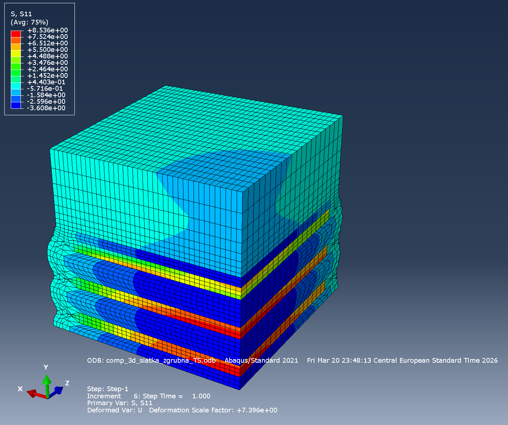
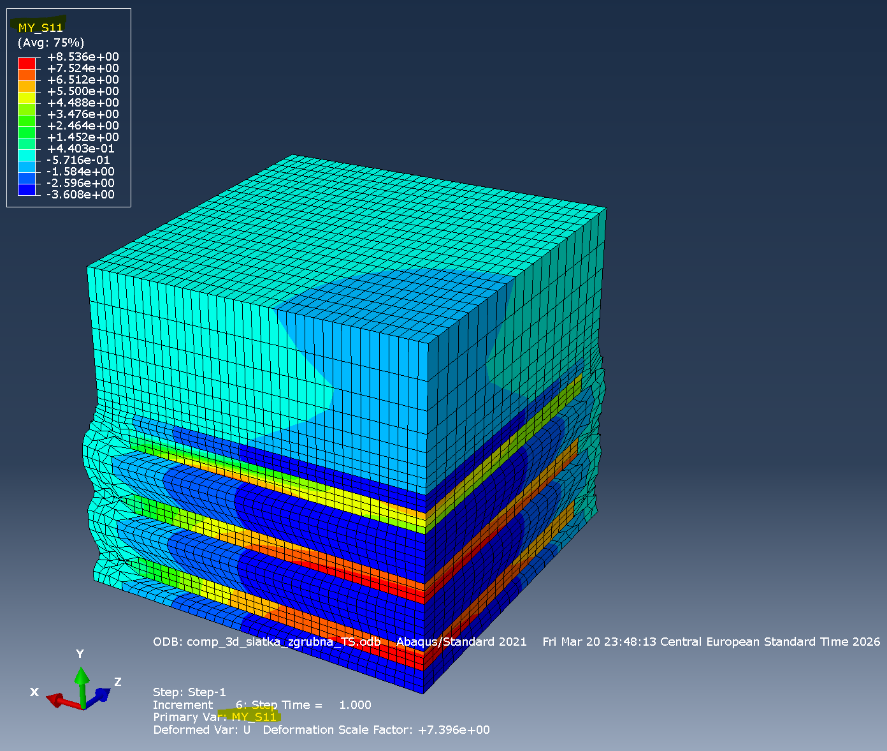

# odb-toolkit

**A pipeline for defining and injecting custom field outputs into Abaqus ODB files, with computations in Python 3.**

## Comparison

| Abaqus S11 | Custom MY\_S11 |
|:---:|:---:|
|  |  |

## Structure

```
main.py           Py3 orchestrator
config.yaml       Configuration
field_defs.py     User-defined field functions (Py3)
src/
  extract.py      Abaqus Py2 — reads ODB → JSON + mesh
  compute.py      Py3 — applies field_defs → JSON
  inject.py       Abaqus Py2 — writes results → ODB
```

## Quick start

```bash
pip install pyyaml
# edit config.yaml and field_defs.py
python main.py
# reload your odb file
```
> ⚠️ **Note:** Output file is overwritten on each run.

## config.yaml

```yaml
odb_path: results.odb
sources: [S, U]       # or: ALL
keep_data: true       # keep .tmp/ after run
abaqus_cmd: abaqus    # or full path to abaqus.bat
```
> ⚠️ **Performance note:** Using `ALL` extracts every available field from
> the ODB. For large models or many increments this can increase extraction
> time significantly. Always prefer an explicit field list.

## field_defs.py

```python
import math

def von_mises(f):
    d = f['S']  # [S11, S22, S33, S12, S13, S23]
    s11, s22, s33, s12, s13, s23 = d[0], d[1], d[2], d[3], d[4], d[5]
    return math.sqrt(0.5 * (
        (s11-s22)**2 + (s22-s33)**2 + (s33-s11)**2
        + 6*(s12**2 + s13**2 + s23**2)))

FIELD_DEFS = [
    {
        'name': 'MY_VONMISES',
        'description': 'Custom von Mises',
        'sources': ['S'],
        'func': von_mises,
        # 'position': 'element',  # optional override
    },
]
```

Each `func` receives a dict mapping source name to component list.
Full Python 3 ecosystem available (numpy, scipy, etc.).

## Cross-position fields (e.g. S × U)

Element (`S`) and nodal (`U`) fields have different label spaces.
When mixed in one definition, `U` is automatically averaged over
element nodes using mesh connectivity. Result is element-based.

Optional `'position'` key overrides output position.
If it conflicts with sources, a warning is printed and auto-position is used.

## Intermediate files (.tmp/)

With `keep_data: true`:
- `extracted.json` — all raw field data from ODB
- `results.json` — computed custom fields
- `mesh.json` — nodes and connectivity per instance
- `runtime.json` — paths config for subprocesses

Load in Jupyter:
```python
import json, numpy as np
with open('.tmp/extracted.json') as f:
    raw = json.load(f)

step_1_part_1 = list(raw.keys())[0]
S = np.array(raw[step_1_part_1]['S']['data'])
labels = raw[step_1_part_1]['S']['labels']
```

## Notes

- Abaqus Py2 scripts use `str()` casts for JSON unicode compatibility
- Element fields with multiple integration points are averaged per element
- `abaqus.bat` may return exit code 0 on errors — pipeline checks for expected output files
- Add `.tmp/` to `.gitignore`